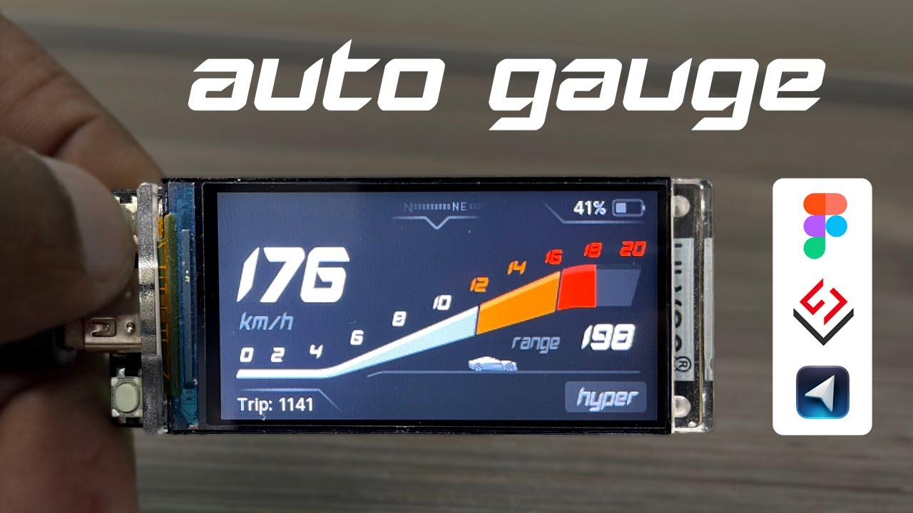
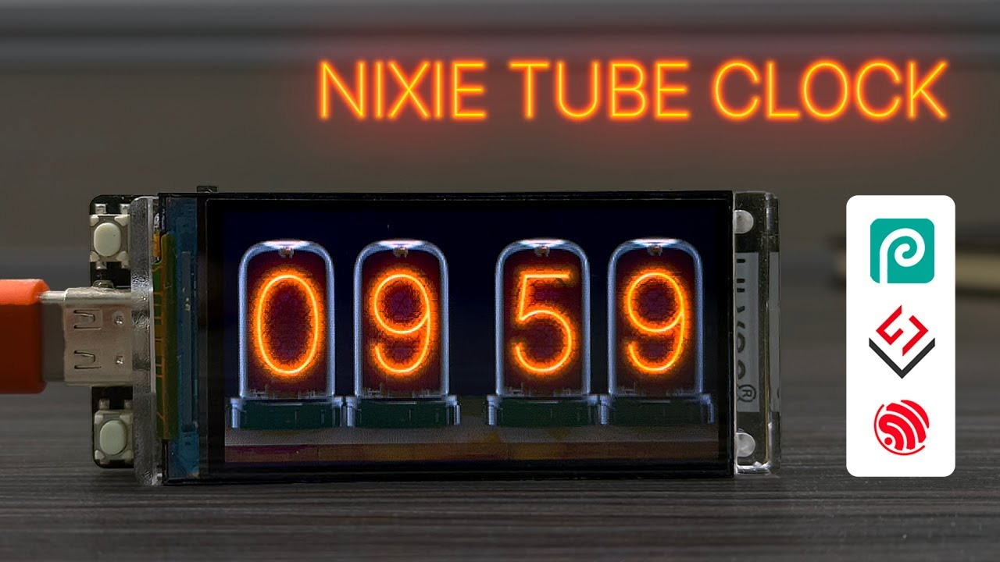
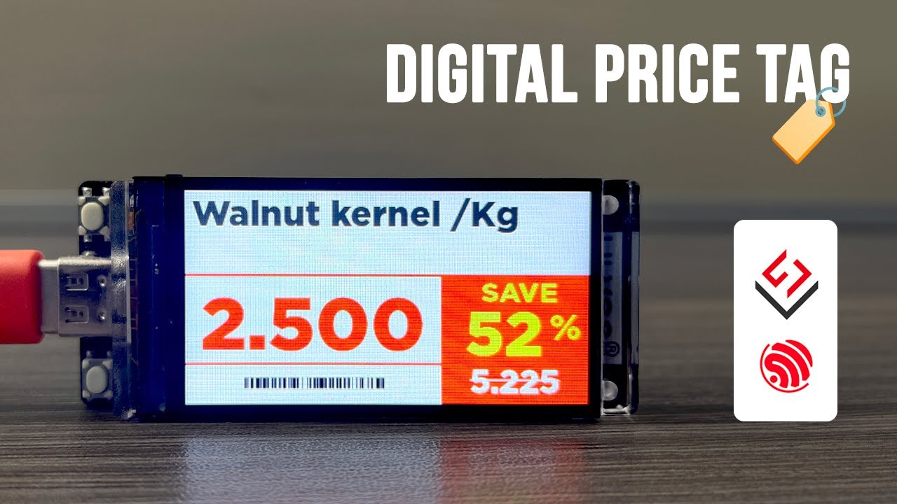
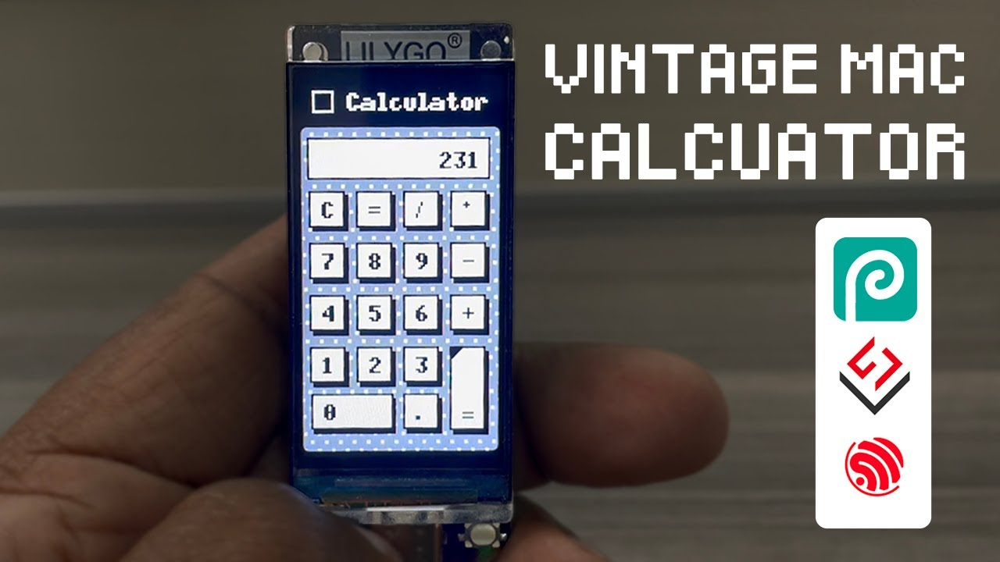
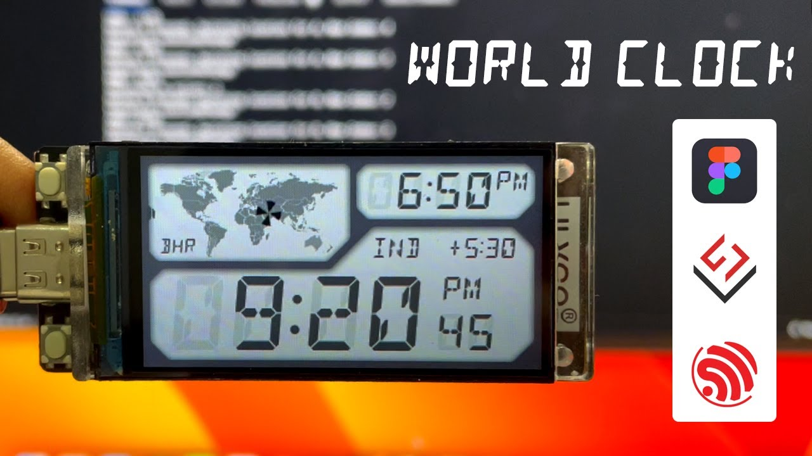
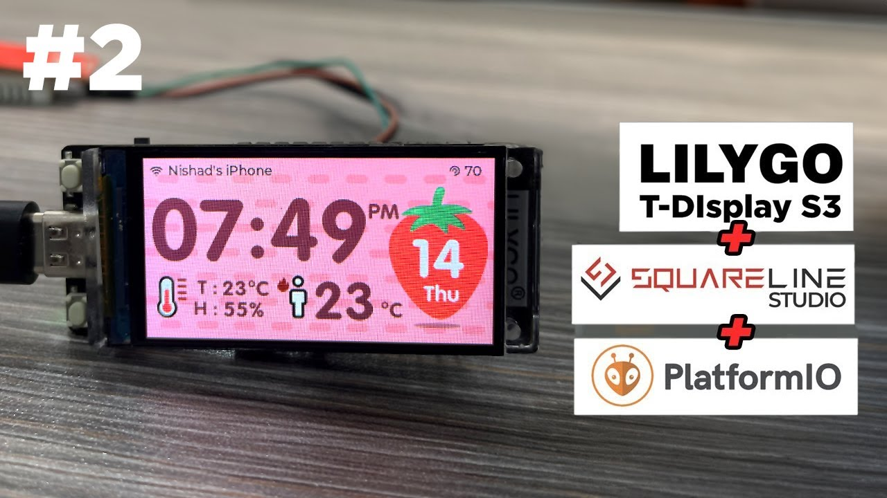

# T-Display-S3-YT

💡 Join the [discussion](https://github.com/nishad2m8/T-Display-S3-YT/discussions) and share your thoughts and ideas!

---
<p align="center">
  <span style="color: yellow;">If you like this, consider supporting it:</span>
</p>

<p align="center">
  <a href="https://www.buymeacoffee.com/nishad2m8" target="_blank">
    
  </a>
  <a href="https://www.youtube.com/channel/UCV_35rUyf4N5mHZXaxaFKiQ" target="_blank">
    
  </a>
</p>

---

Check [OBP](https://github.com/nishad2m8/Squareline-OBP) for Squareline Studio Open Board Platform

---

### ❗Copy all the `libraries` to the project's `lib` folder.

```
Project/
├── lib/
│   ├── lv_conf.h
│   ├── lvgl/
│   ├── TFT_eSPI/
│   └── ui/
├── src/
│   └── main.cpp
```


>
> To resolve potential build errors, modify your `platformio.ini` file and set:
> ```ini
> platform = espressif32 @ 6.5.0
> ```


| No.  | Thumb | Youtube URL |
| ------|-----|----------|
| 17 ||https://youtu.be/8fMlC6O32Bc|
| 16 ||https://youtu.be/ECC2hs8-ZlY|
| 15 ||https://youtu.be/f8gfOKYnp_0|
| 14 | |https://youtu.be/R8-rubHpSm8|
| 13 | |https://youtu.be/nNuizBO6Op8 |
| 12 |   | https://youtu.be/rV4lL5rnFMs|
| 11 |   | https://youtu.be/y1dwVHGadNk|
| 10 |   | https://youtu.be/n_zfqWQbfIw|
| 9 |   | https://youtu.be/fA-LGrint70|
| 8 |  | https://youtu.be/P-8HxCbIPsg|
| 7 |  | https://youtu.be/5JlM6892-Zw|
| 6 |  | https://youtu.be/bRCWRRVrFdg|
| 5 |  |https://youtu.be/Ms3G75Q8F60|
| 4 |  | https://youtu.be/e0AQbNbZpX4 |
| 3 |  | https://youtu.be/5Q8gqp1JxrM|
| 2 |   | https://youtu.be/VwGUaCZ3xvE|
| 1 |   | https://youtu.be/BPWYbxvgGAU |

<!-- | No | Thumb  | URL |  -->